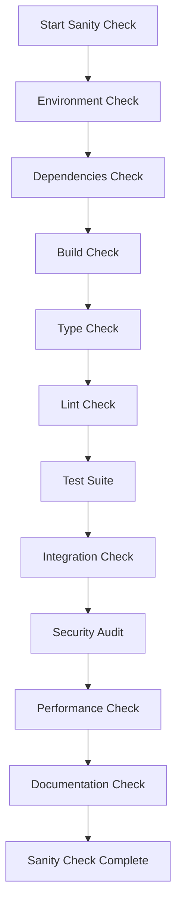

# ElizaOS Core Packages Sanity Check Workflow

This workflow ensures the integrity, consistency, and quality of ElizaOS core packages before deployment or major changes.

## Pre-Flight Checklist



## 1. Environment Sanity Check

### System Requirements Verification

```bash
#!/bin/bash
# check_environment.sh

echo "🔍 Checking ElizaOS Environment..."

# Check Node.js version
check_node() {
    local required="20.0.0"
    local current=$(node -v | cut -d'v' -f2)
    
    if [ "$(printf '%s\n' "$required" "$current" | sort -V | head -n1)" = "$required" ]; then 
        echo "✅ Node.js version: $current"
    else
        echo "❌ Node.js version $current is below required $required"
        exit 1
    fi
}

# Check Bun installation
check_bun() {
    if command -v bun &> /dev/null; then
        echo "✅ Bun installed: $(bun --version)"
    else
        echo "❌ Bun is not installed"
        exit 1
    fi
}

# Check PostgreSQL with pgvector
check_postgres() {
    if command -v psql &> /dev/null; then
        local version=$(psql --version | awk '{print $3}')
        echo "✅ PostgreSQL installed: $version"
        
        # Check pgvector extension
        psql -c "SELECT * FROM pg_extension WHERE extname = 'vector';" 2>/dev/null || {
            echo "⚠️  pgvector extension not found"
        }
    else
        echo "⚠️  PostgreSQL not found (optional for development)"
    fi
}

# Check environment variables
check_env_vars() {
    local required_vars=(
        "DATABASE_URL"
        "OPENAI_API_KEY"
        "JWT_SECRET"
    )
    
    echo "📋 Checking environment variables..."
    for var in "${required_vars[@]}"; do
        if [ -z "${!var}" ]; then
            echo "⚠️  $var is not set"
        else
            echo "✅ $var is configured"
        fi
    done
}

check_node
check_bun
check_postgres
check_env_vars

echo "✨ Environment check complete!"
```

## 2. Dependencies Sanity Check

### Dependency Validation Script

```typescript
// scripts/check-dependencies.ts
import { readFileSync, existsSync } from 'fs';
import { join } from 'path';
import { execSync } from 'child_process';

interface PackageJson {
  name: string;
  version: string;
  dependencies?: Record<string, string>;
  devDependencies?: Record<string, string>;
  peerDependencies?: Record<string, string>;
}

class DependencyChecker {
  private packages = [
    '@elizaos/core',
    '@elizaos/api-client',
    '@elizaos/config',
    '@elizaos/server'
  ];

  async checkAll(): Promise<void> {
    console.log('🔍 Checking package dependencies...\n');
    
    for (const pkg of this.packages) {
      await this.checkPackage(pkg);
    }
    
    await this.checkWorkspaceDependencies();
    await this.checkVersionConsistency();
    await this.checkSecurityVulnerabilities();
  }

  private async checkPackage(packageName: string): Promise<void> {
    const pkgPath = join(process.cwd(), 'packages', packageName.split('/')[1], 'package.json');
    
    if (!existsSync(pkgPath)) {
      console.error(`❌ Package ${packageName} not found`);
      return;
    }
    
    const pkg: PackageJson = JSON.parse(readFileSync(pkgPath, 'utf-8'));
    console.log(`📦 Checking ${pkg.name}@${pkg.version}`);
    
    // Check for workspace protocol
    if (pkg.dependencies) {
      for (const [dep, version] of Object.entries(pkg.dependencies)) {
        if (dep.startsWith('@elizaos/') && !version.startsWith('workspace:')) {
          console.warn(`  ⚠️  Internal dependency ${dep} should use workspace protocol`);
        }
      }
    }
    
    // Check for missing peer dependencies
    if (pkg.peerDependencies) {
      console.log(`  📌 Peer dependencies: ${Object.keys(pkg.peerDependencies).join(', ')}`);
    }
    
    console.log(`  ✅ Dependencies validated\n`);
  }

  private async checkWorkspaceDependencies(): Promise<void> {
    console.log('🔗 Checking workspace dependencies...');
    
    try {
      execSync('bun install --frozen-lockfile', { stdio: 'pipe' });
      console.log('  ✅ Lockfile is up to date');
    } catch (error) {
      console.error('  ❌ Lockfile needs update - run "bun install"');
      process.exit(1);
    }
  }

  private async checkVersionConsistency(): Promise<void> {
    console.log('🔢 Checking version consistency...');
    
    const versions = new Map<string, Set<string>>();
    
    for (const pkg of this.packages) {
      const pkgPath = join(process.cwd(), 'packages', pkg.split('/')[1], 'package.json');
      const pkgJson: PackageJson = JSON.parse(readFileSync(pkgPath, 'utf-8'));
      
      // Track all dependency versions
      const allDeps = {
        ...pkgJson.dependencies,
        ...pkgJson.devDependencies
      };
      
      for (const [dep, version] of Object.entries(allDeps)) {
        if (!versions.has(dep)) {
          versions.set(dep, new Set());
        }
        versions.get(dep)!.add(version);
      }
    }
    
    // Check for version conflicts
    for (const [dep, versionSet] of versions.entries()) {
      if (versionSet.size > 1 && !dep.startsWith('@elizaos/')) {
        console.warn(`  ⚠️  Multiple versions of ${dep}: ${Array.from(versionSet).join(', ')}`);
      }
    }
    
    console.log('  ✅ Version consistency checked\n');
  }

  private async checkSecurityVulnerabilities(): Promise<void> {
    console.log('🔒 Checking security vulnerabilities...');
    
    try {
      execSync('bun audit', { stdio: 'pipe' });
      console.log('  ✅ No security vulnerabilities found');
    } catch (error) {
      console.warn('  ⚠️  Security audit found issues - review "bun audit" output');
    }
  }
}

// Run the checker
const checker = new DependencyChecker();
checker.checkAll().catch(console.error);
```

## 3. Build Sanity Check

### Multi-Package Build Verification

```typescript
// scripts/build-check.ts
import { execSync } from 'child_process';
import { existsSync } from 'fs';
import { join } from 'path';

interface BuildResult {
  package: string;
  success: boolean;
  duration: number;
  errors?: string[];
}

class BuildChecker {
  private packages = [
    { name: 'config', order: 1 },
    { name: 'core', order: 2 },
    { name: 'server', order: 3 },
    { name: 'api-client', order: 4 }
  ];

  async checkBuilds(): Promise<void> {
    console.log('🔨 Starting build sanity check...\n');
    
    const results: BuildResult[] = [];
    
    // Sort packages by build order
    const sortedPackages = this.packages.sort((a, b) => a.order - b.order);
    
    for (const pkg of sortedPackages) {
      const result = await this.buildPackage(pkg.name);
      results.push(result);
      
      if (!result.success) {
        console.error(`❌ Build failed for ${pkg.name}`);
        this.printBuildErrors(result);
        process.exit(1);
      }
    }
    
    this.printBuildSummary(results);
    await this.verifyBuildArtifacts();
  }

  private async buildPackage(name: string): Promise<BuildResult> {
    const pkgPath = join(process.cwd(), 'packages', name);
    console.log(`📦 Building @elizaos/${name}...`);
    
    const startTime = Date.now();
    const result: BuildResult = {
      package: name,
      success: false,
      duration: 0
    };
    
    try {
      // Clean previous build
      execSync('rm -rf dist', { cwd: pkgPath, stdio: 'pipe' });
      
      // Run build
      execSync('bun run build', { cwd: pkgPath, stdio: 'pipe' });
      
      result.success = true;
      result.duration = Date.now() - startTime;
      
      console.log(`  ✅ Built in ${(result.duration / 1000).toFixed(2)}s\n`);
    } catch (error: any) {
      result.errors = error.toString().split('\n');
      result.duration = Date.now() - startTime;
    }
    
    return result;
  }

  private async verifyBuildArtifacts(): Promise<void> {
    console.log('📁 Verifying build artifacts...');
    
    for (const pkg of this.packages) {
      const distPath = join(process.cwd(), 'packages', pkg.name, 'dist');
      
      if (!existsSync(distPath)) {
        console.error(`  ❌ Missing dist folder for ${pkg.name}`);
        process.exit(1);
      }
      
      // Check for required files
      const requiredFiles = ['index.js', 'index.d.ts'];
      
      // Special case for core package
      if (pkg.name === 'core') {
        requiredFiles.push('node/index.node.js', 'browser/index.browser.js');
      }
      
      for (const file of requiredFiles) {
        const filePath = join(distPath, file);
        if (!existsSync(filePath)) {
          console.warn(`  ⚠️  Missing ${file} in ${pkg.name}/dist`);
        }
      }
    }
    
    console.log('  ✅ Build artifacts verified\n');
  }

  private printBuildSummary(results: BuildResult[]): void {
    console.log('\n📊 Build Summary:');
    console.log('━'.repeat(50));
    
    const totalDuration = results.reduce((sum, r) => sum + r.duration, 0);
    
    for (const result of results) {
      const status = result.success ? '✅' : '❌';
      const time = (result.duration / 1000).toFixed(2);
      console.log(`${status} @elizaos/${result.package}: ${time}s`);
    }
    
    console.log('━'.repeat(50));
    console.log(`Total build time: ${(totalDuration / 1000).toFixed(2)}s\n`);
  }

  private printBuildErrors(result: BuildResult): void {
    if (result.errors && result.errors.length > 0) {
      console.error('\n🔴 Build Errors:');
      result.errors.forEach(error => console.error(`  ${error}`));
    }
  }
}

// Run the build checker
const checker = new BuildChecker();
checker.checkBuilds().catch(console.error);
```

## 4. Type Safety Check

### TypeScript Type Checking

```typescript
// scripts/type-check.ts
import { execSync } from 'child_process';
import { readFileSync } from 'fs';
import { join } from 'path';

class TypeChecker {
  private packages = ['core', 'api-client', 'config', 'server'];

  async checkTypes(): Promise<void> {
    console.log('🔍 Running type safety checks...\n');
    
    for (const pkg of this.packages) {
      await this.checkPackageTypes(pkg);
    }
    
    await this.checkCrossPackageTypes();
    await this.checkStrictMode();
  }

  private async checkPackageTypes(name: string): Promise<void> {
    const pkgPath = join(process.cwd(), 'packages', name);
    console.log(`📦 Type checking @elizaos/${name}...`);
    
    try {
      execSync('bun tsc --noEmit', { cwd: pkgPath, stdio: 'pipe' });
      console.log(`  ✅ No type errors found\n`);
    } catch (error: any) {
      console.error(`  ❌ Type errors found:`);
      const errors = error.stdout?.toString() || error.toString();
      console.error(errors);
      process.exit(1);
    }
  }

  private async checkCrossPackageTypes(): Promise<void> {
    console.log('🔗 Checking cross-package type compatibility...');
    
    // Create a test file that imports from all packages
    const testContent = `
import { AgentRuntime, IAgentRuntime } from '@elizaos/core';
import { ElizaClient } from '@elizaos/api-client';
import { createApiRouter } from '@elizaos/server';
import { tsConfigBase } from '@elizaos/config';

// Test type compatibility
const runtime: IAgentRuntime = {} as any;
const client = new ElizaClient({ baseUrl: '', apiKey: '' });
const router = createApiRouter(new Map());
    `;
    
    // Write temporary test file and check it
    const tmpFile = join(process.cwd(), 'type-test.ts');
    require('fs').writeFileSync(tmpFile, testContent);
    
    try {
      execSync(`bun tsc ${tmpFile} --noEmit --esModuleInterop --skipLibCheck`, { 
        stdio: 'pipe' 
      });
      console.log('  ✅ Cross-package types are compatible\n');
    } catch (error) {
      console.error('  ❌ Cross-package type compatibility issues');
    } finally {
      require('fs').unlinkSync(tmpFile);
    }
  }

  private async checkStrictMode(): Promise<void> {
    console.log('🔒 Verifying TypeScript strict mode...');
    
    for (const pkg of this.packages) {
      const tsconfigPath = join(process.cwd(), 'packages', pkg, 'tsconfig.json');
      const tsconfig = JSON.parse(readFileSync(tsconfigPath, 'utf-8'));
      
      const strictOptions = [
        'strict',
        'noImplicitAny',
        'strictNullChecks',
        'strictFunctionTypes',
        'strictBindCallApply',
        'strictPropertyInitialization',
        'noImplicitThis',
        'alwaysStrict'
      ];
      
      for (const option of strictOptions) {
        if (tsconfig.compilerOptions[option] === false) {
          console.warn(`  ⚠️  ${pkg}: ${option} is disabled`);
        }
      }
    }
    
    console.log('  ✅ Strict mode verification complete\n');
  }
}

// Run the type checker
const checker = new TypeChecker();
checker.checkTypes().catch(console.error);
```

## 5. Testing Sanity Check

### Comprehensive Test Suite Runner

```typescript
// scripts/test-sanity.ts
import { execSync } from 'child_process';
import { existsSync } from 'fs';
import { join } from 'path';

interface TestResult {
  package: string;
  passed: number;
  failed: number;
  skipped: number;
  coverage?: {
    statements: number;
    branches: number;
    functions: number;
    lines: number;
  };
}

class TestRunner {
  private packages = ['core', 'api-client', 'server'];
  private minCoverage = {
    statements: 80,
    branches: 75,
    functions: 80,
    lines: 80
  };

  async runTests(): Promise<void> {
    console.log('🧪 Running test sanity checks...\n');
    
    const results: TestResult[] = [];
    
    // Run unit tests
    for (const pkg of this.packages) {
      const result = await this.runPackageTests(pkg, 'unit');
      results.push(result);
    }
    
    // Run integration tests
    await this.runIntegrationTests();
    
    // Check coverage
    this.checkCoverage(results);
    
    // Print summary
    this.printTestSummary(results);
  }

  private async runPackageTests(name: string, type: string): Promise<TestResult> {
    const pkgPath = join(process.cwd(), 'packages', name);
    console.log(`📦 Running ${type} tests for @elizaos/${name}...`);
    
    const result: TestResult = {
      package: name,
      passed: 0,
      failed: 0,
      skipped: 0
    };
    
    try {
      const output = execSync('bun test --coverage', { 
        cwd: pkgPath, 
        encoding: 'utf-8'
      });
      
      // Parse test results
      const passedMatch = output.match(/(\d+) passed/);
      const failedMatch = output.match(/(\d+) failed/);
      const skippedMatch = output.match(/(\d+) skipped/);
      
      result.passed = passedMatch ? parseInt(passedMatch[1]) : 0;
      result.failed = failedMatch ? parseInt(failedMatch[1]) : 0;
      result.skipped = skippedMatch ? parseInt(skippedMatch[1]) : 0;
      
      // Parse coverage
      const coverageMatch = output.match(/Statements\s+:\s+([\d.]+)%.*?Branches\s+:\s+([\d.]+)%.*?Functions\s+:\s+([\d.]+)%.*?Lines\s+:\s+([\d.]+)%/s);
      
      if (coverageMatch) {
        result.coverage = {
          statements: parseFloat(coverageMatch[1]),
          branches: parseFloat(coverageMatch[2]),
          functions: parseFloat(coverageMatch[3]),
          lines: parseFloat(coverageMatch[4])
        };
      }
      
      if (result.failed > 0) {
        console.error(`  ❌ ${result.failed} tests failed`);
      } else {
        console.log(`  ✅ ${result.passed} tests passed\n`);
      }
    } catch (error: any) {
      console.error(`  ❌ Test execution failed`);
      result.failed = 1;
    }
    
    return result;
  }

  private async runIntegrationTests(): Promise<void> {
    console.log('🔗 Running integration tests...');
    
    const integrationPath = join(process.cwd(), 'tests', 'integration');
    
    if (!existsSync(integrationPath)) {
      console.warn('  ⚠️  No integration tests found');
      return;
    }
    
    try {
      execSync('bun test', { cwd: integrationPath, stdio: 'inherit' });
      console.log('  ✅ Integration tests passed\n');
    } catch (error) {
      console.error('  ❌ Integration tests failed');
      process.exit(1);
    }
  }

  private checkCoverage(results: TestResult[]): void {
    console.log('📊 Checking test coverage...');
    
    for (const result of results) {
      if (!result.coverage) continue;
      
      const coverage = result.coverage;
      const metrics = ['statements', 'branches', 'functions', 'lines'] as const;
      
      for (const metric of metrics) {
        if (coverage[metric] < this.minCoverage[metric]) {
          console.warn(
            `  ⚠️  ${result.package}: ${metric} coverage ${coverage[metric]}% ` +
            `is below minimum ${this.minCoverage[metric]}%`
          );
        }
      }
    }
    
    console.log('  ✅ Coverage check complete\n');
  }

  private printTestSummary(results: TestResult[]): void {
    console.log('\n📈 Test Summary:');
    console.log('━'.repeat(60));
    console.log('Package'.padEnd(20) + 'Passed'.padEnd(10) + 'Failed'.padEnd(10) + 'Coverage');
    console.log('━'.repeat(60));
    
    for (const result of results) {
      const coverage = result.coverage 
        ? `${result.coverage.lines.toFixed(1)}%`
        : 'N/A';
      
      const status = result.failed === 0 ? '✅' : '❌';
      
      console.log(
        `${status} ${result.package}`.padEnd(20) +
        `${result.passed}`.padEnd(10) +
        `${result.failed}`.padEnd(10) +
        coverage
      );
    }
    
    console.log('━'.repeat(60));
  }
}

// Run the test runner
const runner = new TestRunner();
runner.runTests().catch(console.error);
```

## 6. Linting & Formatting Check

### Code Quality Verification

```bash
#!/bin/bash
# scripts/lint-check.sh

echo "🎨 Running code quality checks..."

# Function to check a package
check_package() {
    local pkg=$1
    echo "📦 Checking @elizaos/$pkg..."
    
    cd "packages/$pkg"
    
    # Run Prettier check
    echo "  Checking formatting..."
    if bun run format:check > /dev/null 2>&1; then
        echo "  ✅ Formatting is correct"
    else
        echo "  ❌ Formatting issues found - run 'bun run format'"
        exit 1
    fi
    
    # Run ESLint
    if [ -f ".eslintrc.js" ] || [ -f "eslint.config.js" ]; then
        echo "  Running ESLint..."
        if bun run lint > /dev/null 2>&1; then
            echo "  ✅ No linting issues"
        else
            echo "  ⚠️  Linting issues found - run 'bun run lint'"
        fi
    fi
    
    cd ../..
    echo ""
}

# Check all packages
for pkg in core api-client config server; do
    check_package $pkg
done

echo "✨ Code quality check complete!"
```

## 7. Integration Sanity Check

### End-to-End System Verification

```typescript
// scripts/integration-check.ts
import { spawn } from 'child_process';
import { ElizaClient } from '@elizaos/api-client';

class IntegrationChecker {
  private serverProcess: any;
  private client: ElizaClient;
  
  async runIntegrationCheck(): Promise<void> {
    console.log('🔌 Running integration sanity check...\n');
    
    try {
      // Start server
      await this.startServer();
      
      // Initialize client
      this.client = new ElizaClient({
        baseUrl: 'http://localhost:3000',
        apiKey: 'test-integration-key'
      });
      
      // Run integration tests
      await this.testAgentCreation();
      await this.testMessaging();
      await this.testMemory();
      await this.testWebSocket();
      
      console.log('✅ All integration checks passed!\n');
    } catch (error) {
      console.error('❌ Integration check failed:', error);
      process.exit(1);
    } finally {
      await this.cleanup();
    }
  }
  
  private async startServer(): Promise<void> {
    console.log('🚀 Starting test server...');
    
    this.serverProcess = spawn('bun', ['run', 'dev'], {
      cwd: join(process.cwd(), 'packages', 'server'),
      detached: true,
      stdio: 'pipe'
    });
    
    // Wait for server to be ready
    await new Promise((resolve) => {
      this.serverProcess.stdout.on('data', (data: Buffer) => {
        if (data.toString().includes('Server listening')) {
          console.log('  ✅ Server started\n');
          resolve(true);
        }
      });
    });
  }
  
  private async testAgentCreation(): Promise<void> {
    console.log('🤖 Testing agent creation...');
    
    const agent = await this.client.agents.create({
      character: {
        name: 'Test Agent',
        bio: 'Integration test agent'
      }
    });
    
    if (!agent.id) {
      throw new Error('Agent creation failed');
    }
    
    // Verify agent exists
    const retrieved = await this.client.agents.get(agent.id);
    if (retrieved.character.name !== 'Test Agent') {
      throw new Error('Agent retrieval failed');
    }
    
    console.log('  ✅ Agent creation works\n');
  }
  
  private async testMessaging(): Promise<void> {
    console.log('💬 Testing messaging...');
    
    const agents = await this.client.agents.list();
    if (agents.length === 0) {
      throw new Error('No agents available');
    }
    
    const response = await this.client.messaging.send({
      agentId: agents[0].id,
      content: {
        text: 'Hello, integration test!'
      }
    });
    
    if (!response.id) {
      throw new Error('Message sending failed');
    }
    
    console.log('  ✅ Messaging works\n');
  }
  
  private async testMemory(): Promise<void> {
    console.log('🧠 Testing memory operations...');
    
    const agents = await this.client.agents.list();
    const agentId = agents[0].id;
    
    // Create memory
    const memory = await this.client.memory.create({
      agentId,
      content: {
        text: 'Test memory entry'
      }
    });
    
    // Search memories
    const results = await this.client.memory.search({
      agentId,
      query: 'test memory'
    });
    
    if (results.length === 0) {
      throw new Error('Memory search failed');
    }
    
    console.log('  ✅ Memory operations work\n');
  }
  
  private async testWebSocket(): Promise<void> {
    console.log('🔌 Testing WebSocket connection...');
    
    return new Promise((resolve, reject) => {
      const ws = new WebSocket('ws://localhost:3000');
      
      ws.onopen = () => {
        console.log('  ✅ WebSocket connection established');
        ws.close();
        resolve();
      };
      
      ws.onerror = (error) => {
        reject(new Error('WebSocket connection failed'));
      };
      
      setTimeout(() => {
        reject(new Error('WebSocket connection timeout'));
      }, 5000);
    });
  }
  
  private async cleanup(): Promise<void> {
    console.log('🧹 Cleaning up...');
    
    if (this.serverProcess) {
      process.kill(-this.serverProcess.pid, 'SIGTERM');
    }
  }
}

// Run integration check
const checker = new IntegrationChecker();
checker.runIntegrationCheck().catch(console.error);
```

## 8. Security Audit

### Security Vulnerability Check

```bash
#!/bin/bash
# scripts/security-audit.sh

echo "🔒 Running security audit..."

# Check for sensitive data in code
echo "📝 Checking for hardcoded secrets..."
if grep -r "OPENAI_API_KEY\|JWT_SECRET\|DATABASE_URL" packages/ --include="*.ts" --include="*.js" | grep -v "process.env" | grep -v "example" | grep -v "test"; then
    echo "  ❌ Found potential hardcoded secrets!"
    exit 1
else
    echo "  ✅ No hardcoded secrets found"
fi

# Check dependencies for vulnerabilities
echo "🔍 Auditing dependencies..."
bun audit

# Check for insecure patterns
echo "🚨 Checking for insecure patterns..."

# Check for eval usage
if grep -r "eval(" packages/ --include="*.ts" --include="*.js"; then
    echo "  ⚠️  Found eval() usage - review for security"
fi

# Check for SQL injection risks
if grep -r "query.*\${" packages/ --include="*.ts" | grep -v "prepared"; then
    echo "  ⚠️  Found potential SQL injection risk - use prepared statements"
fi

echo "✅ Security audit complete!"
```

## 9. Performance Check

### Performance Baseline Verification

```typescript
// scripts/performance-check.ts
import { performance } from 'perf_hooks';
import { AgentRuntime } from '@elizaos/core';
import { ElizaClient } from '@elizaos/api-client';

class PerformanceChecker {
  private benchmarks = {
    runtimeInit: 1000,      // Max 1 second
    messageProcess: 500,    // Max 500ms
    memorySearch: 200,      // Max 200ms
    apiResponse: 100,       // Max 100ms
  };

  async runPerformanceChecks(): Promise<void> {
    console.log('⚡ Running performance checks...\n');
    
    await this.benchmarkRuntimeInit();
    await this.benchmarkMessageProcessing();
    await this.benchmarkMemoryOperations();
    await this.benchmarkAPILatency();
    
    console.log('✅ Performance checks complete!\n');
  }

  private async benchmarkRuntimeInit(): Promise<void> {
    console.log('⏱️  Benchmarking runtime initialization...');
    
    const start = performance.now();
    
    const runtime = new AgentRuntime({
      character: { name: 'Perf Test' },
      databaseAdapter: createTestAdapter()
    });
    
    await runtime.initialize();
    
    const duration = performance.now() - start;
    
    if (duration > this.benchmarks.runtimeInit) {
      console.warn(`  ⚠️  Runtime init took ${duration.toFixed(2)}ms (max: ${this.benchmarks.runtimeInit}ms)`);
    } else {
      console.log(`  ✅ Runtime init: ${duration.toFixed(2)}ms`);
    }
    
    await runtime.stop();
  }

  private async benchmarkMessageProcessing(): Promise<void> {
    console.log('⏱️  Benchmarking message processing...');
    
    const runtime = await createTestRuntime();
    const messages = generateTestMessages(100);
    
    const times: number[] = [];
    
    for (const message of messages) {
      const start = performance.now();
      await runtime.processMessage(message);
      times.push(performance.now() - start);
    }
    
    const avg = times.reduce((a, b) => a + b, 0) / times.length;
    const max = Math.max(...times);
    
    console.log(`  📊 Average: ${avg.toFixed(2)}ms, Max: ${max.toFixed(2)}ms`);
    
    if (avg > this.benchmarks.messageProcess) {
      console.warn(`  ⚠️  Message processing is slow`);
    } else {
      console.log(`  ✅ Message processing within limits`);
    }
  }

  private async benchmarkMemoryOperations(): Promise<void> {
    console.log('⏱️  Benchmarking memory operations...');
    
    const runtime = await createTestRuntime();
    
    // Create test memories
    for (let i = 0; i < 1000; i++) {
      await runtime.createMemory({
        content: { text: `Test memory ${i}` }
      });
    }
    
    // Benchmark search
    const searchQueries = ['test', 'memory', 'search query'];
    const times: number[] = [];
    
    for (const query of searchQueries) {
      const start = performance.now();
      await runtime.searchMemories(query, { count: 10 });
      times.push(performance.now() - start);
    }
    
    const avg = times.reduce((a, b) => a + b, 0) / times.length;
    
    if (avg > this.benchmarks.memorySearch) {
      console.warn(`  ⚠️  Memory search took ${avg.toFixed(2)}ms (max: ${this.benchmarks.memorySearch}ms)`);
    } else {
      console.log(`  ✅ Memory search: ${avg.toFixed(2)}ms`);
    }
  }

  private async benchmarkAPILatency(): Promise<void> {
    console.log('⏱️  Benchmarking API latency...');
    
    const client = new ElizaClient({
      baseUrl: 'http://localhost:3000',
      apiKey: 'test'
    });
    
    const times: number[] = [];
    
    for (let i = 0; i < 10; i++) {
      const start = performance.now();
      await client.system.health();
      times.push(performance.now() - start);
    }
    
    const avg = times.reduce((a, b) => a + b, 0) / times.length;
    
    if (avg > this.benchmarks.apiResponse) {
      console.warn(`  ⚠️  API latency is high: ${avg.toFixed(2)}ms`);
    } else {
      console.log(`  ✅ API latency: ${avg.toFixed(2)}ms`);
    }
  }
}

// Run performance checks
const checker = new PerformanceChecker();
checker.runPerformanceChecks().catch(console.error);
```

## 10. Documentation Check

### Documentation Completeness Verification

```typescript
// scripts/docs-check.ts
import { readFileSync, existsSync } from 'fs';
import { join } from 'path';

class DocumentationChecker {
  private packages = ['core', 'api-client', 'config', 'server'];
  
  async checkDocumentation(): Promise<void> {
    console.log('📚 Checking documentation...\n');
    
    for (const pkg of this.packages) {
      await this.checkPackageDocs(pkg);
    }
    
    await this.checkApiDocs();
    await this.checkExamples();
    await this.checkChangelog();
  }
  
  private async checkPackageDocs(name: string): Promise<void> {
    console.log(`📦 Checking @elizaos/${name} documentation...`);
    
    const pkgPath = join(process.cwd(), 'packages', name);
    
    // Check README
    const readmePath = join(pkgPath, 'README.md');
    if (!existsSync(readmePath)) {
      console.error(`  ❌ Missing README.md`);
      return;
    }
    
    const readme = readFileSync(readmePath, 'utf-8');
    
    // Check for required sections
    const requiredSections = [
      '## Installation',
      '## Usage',
      '## API',
      '## Examples'
    ];
    
    for (const section of requiredSections) {
      if (!readme.includes(section)) {
        console.warn(`  ⚠️  Missing section: ${section}`);
      }
    }
    
    // Check for code examples
    const codeBlocks = readme.match(/```[a-z]*\n[\s\S]*?\n```/g) || [];
    if (codeBlocks.length < 2) {
      console.warn(`  ⚠️  Insufficient code examples`);
    }
    
    console.log(`  ✅ Documentation present\n`);
  }
  
  private async checkApiDocs(): Promise<void> {
    console.log('🔌 Checking API documentation...');
    
    const apiDocsPath = join(process.cwd(), 'docs', 'api');
    
    if (!existsSync(apiDocsPath)) {
      console.warn('  ⚠️  API documentation folder missing');
      return;
    }
    
    // Check for OpenAPI/Swagger spec
    const openApiPath = join(apiDocsPath, 'openapi.json');
    if (existsSync(openApiPath)) {
      console.log('  ✅ OpenAPI specification found');
    } else {
      console.warn('  ⚠️  OpenAPI specification missing');
    }
  }
  
  private async checkExamples(): Promise<void> {
    console.log('💡 Checking examples...');
    
    const examplesPath = join(process.cwd(), 'examples');
    
    if (!existsSync(examplesPath)) {
      console.warn('  ⚠️  Examples folder missing');
      return;
    }
    
    const requiredExamples = [
      'basic-agent',
      'api-client-usage',
      'custom-plugin',
      'server-setup'
    ];
    
    for (const example of requiredExamples) {
      const examplePath = join(examplesPath, example);
      if (!existsSync(examplePath)) {
        console.warn(`  ⚠️  Missing example: ${example}`);
      }
    }
    
    console.log('  ✅ Examples checked\n');
  }
  
  private async checkChangelog(): Promise<void> {
    console.log('📝 Checking changelog...');
    
    const changelogPath = join(process.cwd(), 'CHANGELOG.md');
    
    if (!existsSync(changelogPath)) {
      console.warn('  ⚠️  CHANGELOG.md missing');
      return;
    }
    
    const changelog = readFileSync(changelogPath, 'utf-8');
    
    // Check for version entries
    const versionPattern = /## \[\d+\.\d+\.\d+\]/g;
    const versions = changelog.match(versionPattern) || [];
    
    if (versions.length === 0) {
      console.warn('  ⚠️  No version entries in changelog');
    } else {
      console.log(`  ✅ Found ${versions.length} version entries`);
    }
  }
}

// Run documentation check
const checker = new DocumentationChecker();
checker.checkDocumentation().catch(console.error);
```

## Master Sanity Check Script

### Orchestrate All Checks

```bash
#!/bin/bash
# scripts/sanity-check.sh

echo "═══════════════════════════════════════════════════════════════"
echo "                    ElizaOS SANITY CHECK                       "
echo "═══════════════════════════════════════════════════════════════"
echo ""

# Colors for output
RED='\033[0;31m'
GREEN='\033[0;32m'
YELLOW='\033[1;33m'
NC='\033[0m' # No Color

# Track overall status
FAILED=0

# Function to run a check
run_check() {
    local name=$1
    local script=$2
    
    echo -e "${GREEN}▶${NC} Running: $name"
    echo "───────────────────────────────────────────────"
    
    if $script; then
        echo -e "${GREEN}✅ $name passed${NC}\n"
    else
        echo -e "${RED}❌ $name failed${NC}\n"
        FAILED=$((FAILED + 1))
    fi
}

# Run all checks
run_check "Environment Check" "./scripts/check_environment.sh"
run_check "Dependencies Check" "bun run scripts/check-dependencies.ts"
run_check "Build Check" "bun run scripts/build-check.ts"
run_check "Type Check" "bun run scripts/type-check.ts"
run_check "Test Suite" "bun run scripts/test-sanity.ts"
run_check "Code Quality" "./scripts/lint-check.sh"
run_check "Security Audit" "./scripts/security-audit.sh"
run_check "Performance Check" "bun run scripts/performance-check.ts"
run_check "Documentation" "bun run scripts/docs-check.ts"
run_check "Integration Check" "bun run scripts/integration-check.ts"

# Final summary
echo "═══════════════════════════════════════════════════════════════"
if [ $FAILED -eq 0 ]; then
    echo -e "${GREEN}✨ ALL SANITY CHECKS PASSED! ✨${NC}"
    echo "Your ElizaOS packages are ready for deployment!"
else
    echo -e "${RED}⚠️  $FAILED CHECKS FAILED ⚠️${NC}"
    echo "Please fix the issues before proceeding."
    exit 1
fi
echo "═══════════════════════════════════════════════════════════════"
```

## Continuous Monitoring

### Health Check Service

```typescript
// scripts/health-monitor.ts
import { ElizaClient } from '@elizaos/api-client';
import { createServer } from 'http';

class HealthMonitor {
  private client: ElizaClient;
  private checks = new Map<string, boolean>();
  
  constructor() {
    this.client = new ElizaClient({
      baseUrl: process.env.ELIZA_SERVER_URL || 'http://localhost:3000',
      apiKey: process.env.ELIZA_API_KEY || ''
    });
  }
  
  async startMonitoring(): Promise<void> {
    console.log('🏥 Starting health monitoring service...\n');
    
    // Run checks every minute
    setInterval(() => this.runHealthChecks(), 60000);
    
    // Initial check
    await this.runHealthChecks();
    
    // Start health endpoint
    this.startHealthEndpoint();
  }
  
  private async runHealthChecks(): Promise<void> {
    // Server health
    this.checks.set('server', await this.checkServer());
    
    // Database health
    this.checks.set('database', await this.checkDatabase());
    
    // Memory usage
    this.checks.set('memory', await this.checkMemoryUsage());
    
    // API latency
    this.checks.set('latency', await this.checkLatency());
    
    this.logHealthStatus();
  }
  
  private async checkServer(): Promise<boolean> {
    try {
      const health = await this.client.system.health();
      return health.status === 'healthy';
    } catch {
      return false;
    }
  }
  
  private async checkDatabase(): Promise<boolean> {
    try {
      const agents = await this.client.agents.list();
      return true;
    } catch {
      return false;
    }
  }
  
  private async checkMemoryUsage(): Promise<boolean> {
    const usage = process.memoryUsage();
    const heapUsedMB = usage.heapUsed / 1024 / 1024;
    return heapUsedMB < 500; // Alert if over 500MB
  }
  
  private async checkLatency(): Promise<boolean> {
    const start = Date.now();
    await this.client.system.health();
    const latency = Date.now() - start;
    return latency < 200; // Alert if over 200ms
  }
  
  private logHealthStatus(): void {
    const timestamp = new Date().toISOString();
    const allHealthy = Array.from(this.checks.values()).every(v => v);
    
    if (allHealthy) {
      console.log(`[${timestamp}] ✅ All systems healthy`);
    } else {
      console.warn(`[${timestamp}] ⚠️  Health issues detected:`);
      this.checks.forEach((healthy, check) => {
        if (!healthy) {
          console.warn(`  - ${check}: UNHEALTHY`);
        }
      });
    }
  }
  
  private startHealthEndpoint(): void {
    const server = createServer((req, res) => {
      const allHealthy = Array.from(this.checks.values()).every(v => v);
      
      res.writeHead(allHealthy ? 200 : 503, {
        'Content-Type': 'application/json'
      });
      
      res.end(JSON.stringify({
        status: allHealthy ? 'healthy' : 'unhealthy',
        checks: Object.fromEntries(this.checks),
        timestamp: new Date().toISOString()
      }));
    });
    
    server.listen(4000, () => {
      console.log('📊 Health endpoint available at http://localhost:4000\n');
    });
  }
}

// Start monitoring
const monitor = new HealthMonitor();
monitor.startMonitoring().catch(console.error);
```

This comprehensive sanity check workflow ensures that all ElizaOS core packages are functioning correctly, meeting quality standards, and ready for production deployment.
