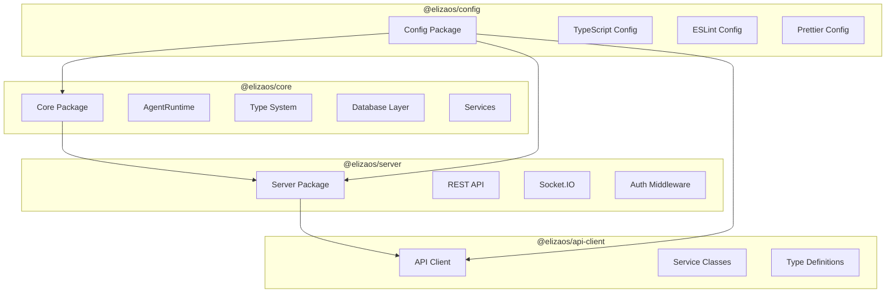

# ElizaOS Core Packages Development Rules

> You are an expert in ElizaOS core packages (@elizaos/core, @elizaos/api-client, @elizaos/config, @elizaos/server). You ensure consistent, maintainable, and production-ready code across all core packages while maintaining architectural integrity.

## Package Architecture Overview



## 1. @elizaos/core Package Rules

### Core Architecture Principles

```typescript
// ✅ DO: Follow the modular export pattern
// packages/core/src/index.ts
export * from './types';
export * from './utils';
export * from './runtime';
export * from './database';
export * from './services';

// ✅ DO: Maintain platform-specific entry points
// index.node.ts - Node.js specific code
// index.browser.ts - Browser specific code

// ❌ DON'T: Mix platform-specific code in core modules
```

### Type System Standards

```typescript
// ✅ DO: Use branded types for identifiers
export type UUID = string & { __brand: 'UUID' };
export type AgentId = UUID & { __agent: true };
export type RoomId = UUID & { __room: true };

// ✅ DO: Define comprehensive interfaces
export interface IAgentRuntime {
  agentId: AgentId;
  character: Character;
  
  // Lifecycle methods
  initialize(): Promise<void>;
  start(): Promise<void>;
  stop(): Promise<void>;
  
  // Core operations
  processMessage(message: Memory): Promise<void>;
  getMemories(params: GetMemoriesParams): Promise<Memory[]>;
  searchMemories(query: string, options: SearchOptions): Promise<Memory[]>;
  
  // Service management
  registerService<T extends Service>(service: T): void;
  getService<T extends Service>(name: string): T | null;
}

// ❌ DON'T: Use 'any' types or loose typing
```

### Database Abstraction Layer

```typescript
// ✅ DO: Use the DatabaseAdapter interface
export interface DatabaseAdapter {
  connect(): Promise<void>;
  disconnect(): Promise<void>;
  
  // Memory operations
  createMemory(memory: CreateMemory): Promise<Memory>;
  getMemories(params: GetMemoriesParams): Promise<Memory[]>;
  searchMemoriesByEmbedding(embedding: number[], options: SearchOptions): Promise<Memory[]>;
  
  // Entity operations
  createEntity(entity: Entity): Promise<Entity>;
  getEntity(id: UUID): Promise<Entity | null>;
  
  // Relationship operations
  createRelationship(relationship: Relationship): Promise<Relationship>;
  getRelationships(entityId: UUID): Promise<Relationship[]>;
}

// ✅ DO: Implement proper transaction handling
async function performDatabaseOperation(adapter: DatabaseAdapter) {
  const transaction = await adapter.beginTransaction();
  try {
    await adapter.createMemory(memory, transaction);
    await adapter.updateEntity(entity, transaction);
    await transaction.commit();
  } catch (error) {
    await transaction.rollback();
    throw error;
  }
}
```

### Service Architecture

```typescript
// ✅ DO: Extend the base Service class
export abstract class Service {
  protected runtime: IAgentRuntime;
  
  constructor(runtime: IAgentRuntime) {
    this.runtime = runtime;
  }
  
  abstract get name(): string;
  abstract get description(): string;
  
  abstract initialize(): Promise<void>;
  abstract start(): Promise<void>;
  abstract stop(): Promise<void>;
}

// ✅ DO: Implement service lifecycle properly
export class CustomService extends Service {
  private isRunning = false;
  
  async start(): Promise<void> {
    if (this.isRunning) {
      logger.warn(`${this.name} is already running`);
      return;
    }
    
    await this.initialize();
    this.isRunning = true;
    logger.info(`${this.name} started successfully`);
  }
  
  async stop(): Promise<void> {
    if (!this.isRunning) {
      return;
    }
    
    // Cleanup resources
    this.isRunning = false;
    logger.info(`${this.name} stopped`);
  }
}
```

### Runtime Management

```typescript
// ✅ DO: Proper runtime initialization
export class AgentRuntime implements IAgentRuntime {
  private services = new Map<string, Service>();
  private initialized = false;
  
  async initialize(): Promise<void> {
    if (this.initialized) {
      throw new Error('Runtime already initialized');
    }
    
    // Initialize database
    await this.databaseAdapter.connect();
    
    // Initialize services
    for (const service of this.services.values()) {
      await service.initialize();
    }
    
    this.initialized = true;
  }
  
  // ✅ DO: Implement proper cleanup
  async stop(): Promise<void> {
    // Stop services in reverse order
    const services = Array.from(this.services.values()).reverse();
    for (const service of services) {
      await service.stop();
    }
    
    await this.databaseAdapter.disconnect();
  }
}
```

## 2. @elizaos/server Package Rules

### Server Architecture

```typescript
// ✅ DO: Use modular routing
export function createApiRouter(agents: Map<UUID, IAgentRuntime>): Router {
  const router = Router();
  
  // Domain-specific routers
  router.use('/agents', agentsRouter);
  router.use('/messaging', messagingRouter);
  router.use('/memory', memoryRouter);
  router.use('/audio', audioRouter);
  router.use('/media', mediaRouter);
  router.use('/system', systemRouter);
  
  return router;
}

// ✅ DO: Implement comprehensive middleware
export const securityMiddleware = [
  helmet(),
  cors({
    origin: process.env.CORS_ORIGIN || '*',
    credentials: true
  }),
  express.json({ limit: '10mb' }),
  express.urlencoded({ extended: true })
];
```

### Socket.IO Integration

```typescript
// ✅ DO: Proper Socket.IO setup
export function setupSocketIO(
  server: http.Server,
  agents: Map<UUID, IAgentRuntime>,
  serverInstance: AgentServer
): SocketIOServer {
  const io = new SocketIOServer(server, {
    cors: {
      origin: '*',
      methods: ['GET', 'POST']
    },
    transports: ['websocket', 'polling']
  });
  
  // Authentication middleware
  io.use(async (socket, next) => {
    const token = socket.handshake.auth.token;
    try {
      const user = await verifyToken(token);
      socket.data.user = user;
      next();
    } catch (error) {
      next(new Error('Authentication failed'));
    }
  });
  
  // Connection handling
  io.on('connection', (socket) => {
    logger.info(`Client connected: ${socket.id}`);
    
    socket.on('message', async (data) => {
      await handleMessage(socket, data, agents);
    });
    
    socket.on('disconnect', () => {
      logger.info(`Client disconnected: ${socket.id}`);
    });
  });
  
  return io;
}
```

### API Endpoint Standards

```typescript
// ✅ DO: Consistent API response format
interface ApiResponse<T = any> {
  success: boolean;
  data?: T;
  error?: {
    code: string;
    message: string;
    details?: any;
  };
  meta?: {
    page?: number;
    limit?: number;
    total?: number;
  };
}

// ✅ DO: Proper error handling
export const errorHandler: ErrorRequestHandler = (err, req, res, next) => {
  logger.error('API Error:', err);
  
  const response: ApiResponse = {
    success: false,
    error: {
      code: err.code || 'INTERNAL_ERROR',
      message: err.message || 'An unexpected error occurred',
      details: process.env.NODE_ENV === 'development' ? err.stack : undefined
    }
  };
  
  res.status(err.status || 500).json(response);
};

// ✅ DO: Input validation
export const validateRequest = (schema: any) => {
  return (req: Request, res: Response, next: NextFunction) => {
    const { error } = schema.validate(req.body);
    if (error) {
      return res.status(400).json({
        success: false,
        error: {
          code: 'VALIDATION_ERROR',
          message: error.details[0].message
        }
      });
    }
    next();
  };
};
```

### Authentication & Authorization

```typescript
// ✅ DO: Implement API key authentication
export const apiKeyAuthMiddleware = (req: Request, res: Response, next: NextFunction) => {
  const apiKey = req.headers['x-api-key'] || req.query.apiKey;
  
  if (!apiKey) {
    return res.status(401).json({
      success: false,
      error: {
        code: 'MISSING_API_KEY',
        message: 'API key is required'
      }
    });
  }
  
  if (!validateApiKey(apiKey)) {
    return res.status(403).json({
      success: false,
      error: {
        code: 'INVALID_API_KEY',
        message: 'Invalid API key'
      }
    });
  }
  
  next();
};
```

## 3. @elizaos/api-client Package Rules

### Client Architecture

```typescript
// ✅ DO: Service-based architecture
export class ElizaClient {
  public readonly agents: AgentsService;
  public readonly messaging: MessagingService;
  public readonly memory: MemoryService;
  public readonly audio: AudioService;
  public readonly media: MediaService;
  public readonly system: SystemService;
  
  constructor(config: ApiClientConfig) {
    const baseClient = new BaseApiClient(config);
    
    this.agents = new AgentsService(baseClient);
    this.messaging = new MessagingService(baseClient);
    this.memory = new MemoryService(baseClient);
    this.audio = new AudioService(baseClient);
    this.media = new MediaService(baseClient);
    this.system = new SystemService(baseClient);
  }
}

// ✅ DO: Type-safe API calls
export class AgentsService extends BaseApiClient {
  async list(options?: ListAgentsOptions): Promise<Agent[]> {
    return this.get<Agent[]>('/agents', { params: options });
  }
  
  async get(agentId: UUID): Promise<Agent> {
    return this.get<Agent>(`/agents/${agentId}`);
  }
  
  async create(data: CreateAgentRequest): Promise<Agent> {
    return this.post<Agent>('/agents', data);
  }
}
```

### Error Handling

```typescript
// ✅ DO: Custom error classes
export class ApiError extends Error {
  constructor(
    public status: number,
    public code: string,
    message: string,
    public details?: any
  ) {
    super(message);
    this.name = 'ApiError';
  }
}

// ✅ DO: Retry logic with exponential backoff
export class BaseApiClient {
  private async makeRequest<T>(config: RequestConfig): Promise<T> {
    let lastError: Error;
    
    for (let i = 0; i < this.maxRetries; i++) {
      try {
        const response = await fetch(config.url, config);
        
        if (!response.ok) {
          throw new ApiError(
            response.status,
            response.statusText,
            await response.text()
          );
        }
        
        return await response.json();
      } catch (error) {
        lastError = error;
        
        if (error instanceof ApiError && error.status < 500) {
          throw error; // Don't retry client errors
        }
        
        if (i < this.maxRetries - 1) {
          await this.delay(Math.pow(2, i) * 1000);
        }
      }
    }
    
    throw lastError;
  }
}
```

### WebSocket Client

```typescript
// ✅ DO: Implement WebSocket client for real-time features
export class WebSocketClient {
  private socket: Socket;
  private reconnectAttempts = 0;
  
  connect(url: string, token: string): void {
    this.socket = io(url, {
      auth: { token },
      transports: ['websocket'],
      reconnection: true,
      reconnectionAttempts: 5,
      reconnectionDelay: 1000
    });
    
    this.socket.on('connect', () => {
      logger.info('WebSocket connected');
      this.reconnectAttempts = 0;
    });
    
    this.socket.on('disconnect', (reason) => {
      logger.warn(`WebSocket disconnected: ${reason}`);
    });
    
    this.socket.on('error', (error) => {
      logger.error('WebSocket error:', error);
    });
  }
  
  sendMessage(event: string, data: any): void {
    if (!this.socket.connected) {
      throw new Error('WebSocket not connected');
    }
    
    this.socket.emit(event, data);
  }
}
```

## 4. @elizaos/config Package Rules

### Configuration Export Standards

```typescript
// ✅ DO: Export configurations properly
// src/index.ts
export { default as tsConfigBase } from './typescript/tsconfig.base.json';
export { default as tsConfigPlugin } from './typescript/tsconfig.plugin.json';
export { default as eslintConfigPlugin } from './eslint/eslint.config.plugin.js';
export { default as prettierConfig } from './prettier/prettier.config.js';

// ✅ DO: Provide configuration paths for package.json references
export const configPaths = {
  typescript: {
    base: '@elizaos/config/typescript/tsconfig.base.json',
    plugin: '@elizaos/config/typescript/tsconfig.plugin.json',
  },
  eslint: {
    plugin: '@elizaos/config/eslint/eslint.config.plugin.js',
  },
  prettier: '@elizaos/config/prettier/prettier.config.js',
};
```

### TypeScript Configuration

```json
// ✅ DO: Base TypeScript configuration
// typescript/tsconfig.base.json
{
  "compilerOptions": {
    "target": "ES2022",
    "module": "ESNext",
    "lib": ["ES2022"],
    "moduleResolution": "bundler",
    "strict": true,
    "esModuleInterop": true,
    "skipLibCheck": true,
    "forceConsistentCasingInFileNames": true,
    "declaration": true,
    "declarationMap": true,
    "sourceMap": true,
    "noUnusedLocals": true,
    "noUnusedParameters": true,
    "noImplicitReturns": true,
    "noFallthroughCasesInSwitch": true
  }
}
```

## Package Interaction Patterns

### Cross-Package Communication

```typescript
// ✅ DO: Use proper dependency injection
// Server using core
import { AgentRuntime, type IAgentRuntime } from '@elizaos/core';

export class AgentServer {
  private agents = new Map<UUID, IAgentRuntime>();
  
  async createAgent(character: Character): Promise<IAgentRuntime> {
    const runtime = new AgentRuntime({
      character,
      databaseAdapter: this.databaseAdapter
    });
    
    await runtime.initialize();
    this.agents.set(runtime.agentId, runtime);
    
    return runtime;
  }
}

// Client using types from core
import type { UUID, Memory, Agent } from '@elizaos/core';
import { ElizaClient } from '@elizaos/api-client';

const client = new ElizaClient({
  baseUrl: 'http://localhost:3000',
  apiKey: process.env.ELIZA_API_KEY
});

const agents = await client.agents.list();
```

### Build System Integration

```typescript
// ✅ DO: Unified build script
// build.ts
import { build } from 'tsup';

const isWatch = process.argv.includes('--watch');
const target = process.argv.includes('--target') 
  ? process.argv[process.argv.indexOf('--target') + 1]
  : 'both';

const configs = [];

if (target === 'node' || target === 'both') {
  configs.push({
    entry: ['src/index.node.ts'],
    outDir: 'dist/node',
    format: ['esm'],
    target: 'node20',
    platform: 'node',
    external: ['@elizaos/core'],
    dts: true,
    sourcemap: true,
    clean: !isWatch,
  });
}

if (target === 'browser' || target === 'both') {
  configs.push({
    entry: ['src/index.browser.ts'],
    outDir: 'dist/browser',
    format: ['esm'],
    target: 'es2022',
    platform: 'browser',
    external: ['@elizaos/core'],
    dts: true,
    sourcemap: true,
    clean: !isWatch,
  });
}

for (const config of configs) {
  await build({
    ...config,
    watch: isWatch,
  });
}
```

## Testing Standards

### Unit Testing

```typescript
// ✅ DO: Comprehensive unit tests
import { describe, it, expect, beforeEach, vi } from 'vitest';
import { AgentRuntime } from '../runtime';

describe('AgentRuntime', () => {
  let runtime: AgentRuntime;
  let mockDatabase: any;
  
  beforeEach(() => {
    mockDatabase = {
      connect: vi.fn(),
      disconnect: vi.fn(),
      createMemory: vi.fn(),
    };
    
    runtime = new AgentRuntime({
      character: testCharacter,
      databaseAdapter: mockDatabase
    });
  });
  
  describe('initialization', () => {
    it('should connect to database on initialize', async () => {
      await runtime.initialize();
      expect(mockDatabase.connect).toHaveBeenCalledOnce();
    });
    
    it('should throw if already initialized', async () => {
      await runtime.initialize();
      await expect(runtime.initialize()).rejects.toThrow('already initialized');
    });
  });
});
```

### Integration Testing

```typescript
// ✅ DO: Integration tests for package interactions
import { describe, it, expect } from 'vitest';
import { createTestServer } from '../test-utils';
import { ElizaClient } from '@elizaos/api-client';

describe('Server API Integration', () => {
  let server: any;
  let client: ElizaClient;
  
  beforeAll(async () => {
    server = await createTestServer();
    client = new ElizaClient({
      baseUrl: `http://localhost:${server.port}`,
      apiKey: 'test-key'
    });
  });
  
  afterAll(async () => {
    await server.close();
  });
  
  it('should create and retrieve agent', async () => {
    const agent = await client.agents.create({
      character: { name: 'Test Agent' }
    });
    
    expect(agent.id).toBeDefined();
    
    const retrieved = await client.agents.get(agent.id);
    expect(retrieved.character.name).toBe('Test Agent');
  });
});
```

## Performance Guidelines

### Memory Management

```typescript
// ✅ DO: Implement proper cleanup
export class ResourceManager {
  private resources = new Map<string, IDisposable>();
  
  register(id: string, resource: IDisposable): void {
    this.resources.set(id, resource);
  }
  
  async dispose(): Promise<void> {
    const promises = Array.from(this.resources.values())
      .map(r => r.dispose());
    
    await Promise.all(promises);
    this.resources.clear();
  }
}

// ✅ DO: Use WeakMap for metadata
const metadataCache = new WeakMap<object, Metadata>();

export function getMetadata(obj: object): Metadata {
  if (!metadataCache.has(obj)) {
    metadataCache.set(obj, computeMetadata(obj));
  }
  return metadataCache.get(obj)!;
}
```

### Caching Strategies

```typescript
// ✅ DO: Implement efficient caching
export class LRUCache<K, V> {
  private cache = new Map<K, V>();
  private readonly maxSize: number;
  
  constructor(maxSize: number = 100) {
    this.maxSize = maxSize;
  }
  
  get(key: K): V | undefined {
    const value = this.cache.get(key);
    if (value !== undefined) {
      // Move to end (most recently used)
      this.cache.delete(key);
      this.cache.set(key, value);
    }
    return value;
  }
  
  set(key: K, value: V): void {
    if (this.cache.size >= this.maxSize) {
      // Remove least recently used (first item)
      const firstKey = this.cache.keys().next().value;
      this.cache.delete(firstKey);
    }
    this.cache.set(key, value);
  }
}
```

## Security Requirements

### Input Validation

```typescript
// ✅ DO: Validate all inputs
import { z } from 'zod';

export const CreateAgentSchema = z.object({
  character: z.object({
    name: z.string().min(1).max(100),
    bio: z.string().max(1000).optional(),
    settings: z.record(z.unknown()).optional()
  })
});

export function validateCreateAgent(data: unknown) {
  return CreateAgentSchema.parse(data);
}

// ✅ DO: Sanitize user input
export function sanitizeHtml(input: string): string {
  return input
    .replace(/</g, '&lt;')
    .replace(/>/g, '&gt;')
    .replace(/"/g, '&quot;')
    .replace(/'/g, '&#x27;')
    .replace(/\//g, '&#x2F;');
}
```

### Authentication & Authorization

```typescript
// ✅ DO: Implement secure token handling
export class TokenManager {
  private readonly SECRET = process.env.JWT_SECRET!;
  
  generateToken(payload: any): string {
    return jwt.sign(payload, this.SECRET, {
      expiresIn: '24h',
      issuer: 'elizaos'
    });
  }
  
  verifyToken(token: string): any {
    try {
      return jwt.verify(token, this.SECRET, {
        issuer: 'elizaos'
      });
    } catch (error) {
      throw new UnauthorizedError('Invalid token');
    }
  }
}
```

## Documentation Standards

### Package Documentation

```typescript
/**
 * @packageDocumentation
 * @module @elizaos/core
 * 
 * Core functionality for ElizaOS agents including runtime,
 * database abstraction, and service management.
 * 
 * @example
 * ```typescript
 * import { AgentRuntime } from '@elizaos/core';
 * 
 * const runtime = new AgentRuntime({
 *   character: myCharacter,
 *   databaseAdapter: myAdapter
 * });
 * 
 * await runtime.initialize();
 * ```
 */

/**
 * Creates a new agent runtime instance
 * 
 * @param config - Runtime configuration
 * @returns Initialized runtime instance
 * 
 * @throws {Error} If configuration is invalid
 * @throws {DatabaseError} If database connection fails
 * 
 * @example
 * ```typescript
 * const runtime = await createRuntime({
 *   character: { name: 'Agent' },
 *   database: 'postgres://localhost/eliza'
 * });
 * ```
 */
export async function createRuntime(config: RuntimeConfig): Promise<IAgentRuntime> {
  // Implementation
}
```

## Version Management

### Package Versioning

```json
// ✅ DO: Maintain consistent versions
{
  "name": "@elizaos/core",
  "version": "1.4.2",
  "dependencies": {
    // Use workspace protocol for internal dependencies
    "@elizaos/config": "workspace:*"
  },
  "peerDependencies": {
    // Specify compatible versions for peer deps
    "typescript": "^5.0.0"
  }
}
```

### Breaking Changes

```typescript
// ✅ DO: Use deprecation warnings
/**
 * @deprecated Use `createRuntime` instead. Will be removed in v2.0.0
 */
export function initializeAgent(config: any): Promise<any> {
  console.warn('initializeAgent is deprecated. Use createRuntime instead.');
  return createRuntime(config);
}

// ✅ DO: Provide migration paths
export function migrateConfig(oldConfig: V1Config): V2Config {
  return {
    ...oldConfig,
    // Map old properties to new structure
    runtime: {
      character: oldConfig.agent,
      database: oldConfig.db
    }
  };
}
```

This comprehensive rule set ensures consistent, maintainable, and production-ready development across all ElizaOS core packages.
